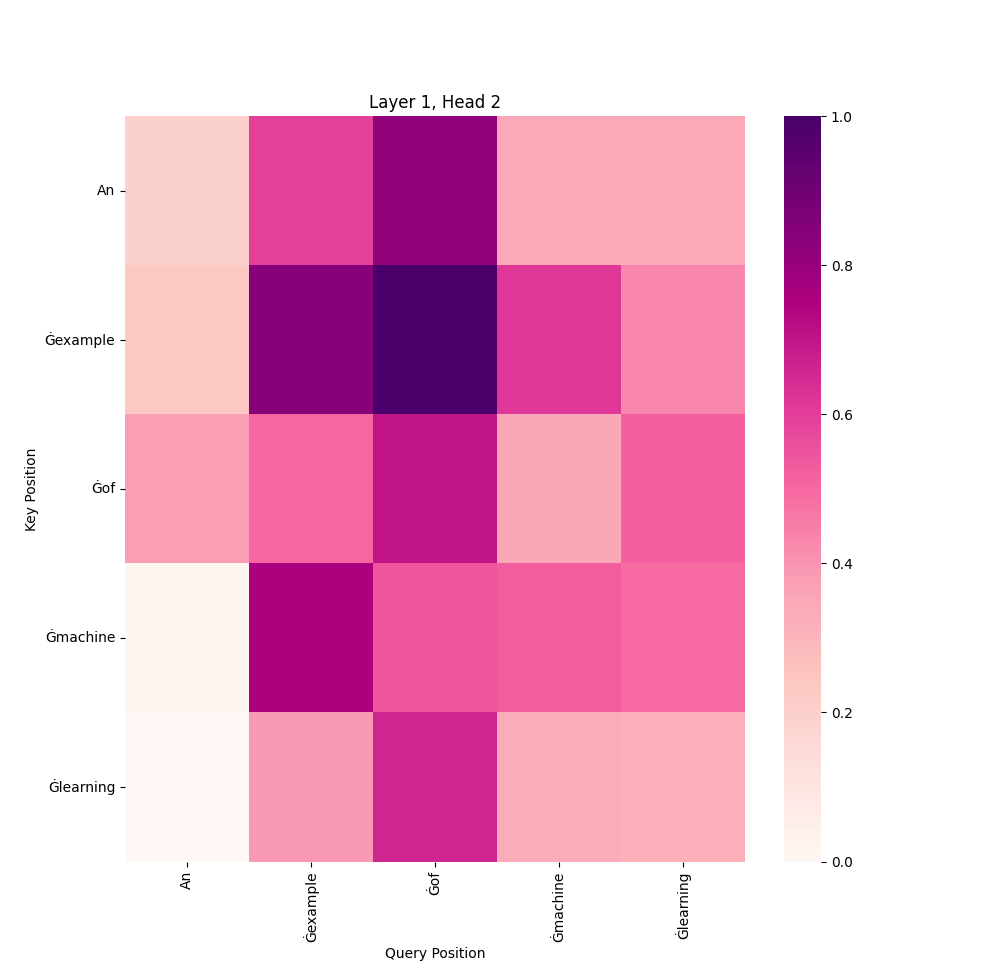
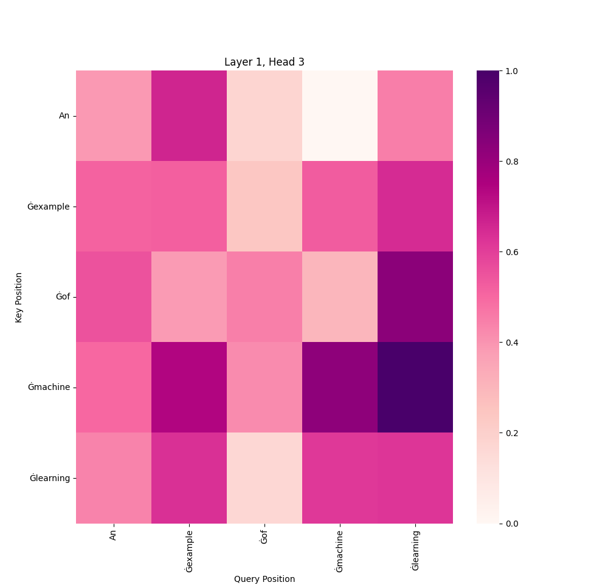

# GPT-2 Model Tutorial

## Overview

This tutorial provides a detailed walkthrough of the GPT-2 model architecture, starting from token input to the final output. We'll explore the embedding layers, position encoding, layer normalization, and attention mechanisms, including multi-head attention and residual connections.

## Visualizing Attention

Here are visualizations of attention patterns for the first few heads of Layer 1 during inference:

### Layer 1, Head 1


### Layer 1, Head 2


### Layer 1, Head 3



## Token Input

The input tokens are first passed into an embedding layer:

```python
Embedding(50257, 768)
```

- **50257**: Vocabulary size
- **768**: Embedding size

Each token is mapped to a tensor of shape `(batch_size, number_of_tokens, embedding_size)`.

Example:
```python
params.input_ids = tensor([[2025, 1672,  286, 4572, 4673]])
input_text = "An example of machine learning"
```

## Position Encoding

The position ids are used to generate position embeddings:

```python
params.position_ids = tensor([[0, 1, 2, 3, 4]])
position_embeds = self.wpe(params.position_ids)  # torch.Size([1, 5, 768])
```

We add the input embeddings and position embeddings together:

```python
hidden_states = params.inputs_embeds + position_embeds
```

## Layer Normalization

The hidden states are normalized:

```python
hidden_states = self.ln_1(hidden_states)  # LayerNorm((768,), eps=1e-05, elementwise_affine=True)
```

## Attention Mechanism

### Attention Block

The attention block consists of the following components:

```python
self.c_attn = Conv1D(nf=3 * self.embed_dim, nx=self.embed_dim)
self.c_proj = Conv1D(nf=self.embed_dim, nx=self.embed_dim)
self.attn_dropout = nn.Dropout(p=config.attn_pdrop)
self.resid_dropout = nn.Dropout(p=config.resid_pdrop)
```

The hidden states are processed through a 1D convolution:

```python
self.c_attn(hidden_states)  # torch.Size([1, 5, 2304])
```

### Splitting into Query, Key, and Value

The hidden states are split into query, key, and value tensors:

```python
query, key, value = self.c_attn(hidden_states).split(self.split_size, dim=2)  # torch.Size([1, 5, 768])
```

### Multi-Head Attention

The query, key, and value tensors are split for multi-head attention:

```python
query, key, value = (
    self._split_heads(tensor=t, num_heads=self.num_heads, attn_head_size=self.head_dim)
    for t in (query, key, value)
)
```

### Attention Weights

The attention weights are computed:

```python
attn_weights = torch.matmul(query, key.transpose(-1, -2))  # torch.Size([1, 12, 5, 5])

if self.scale_attn_weights:
    attn_weights /= torch.sqrt(torch.tensor(value.size(-1), device=attn_weights.device))
```

### Causal Mask and Softmax

A causal mask is applied, and the weights are normalized:

```python
causal_mask = self.bias[:, :, key_length - query_length : key_length, :key_length]
mask_value = torch.finfo(attn_weights.dtype).min

mask_value = torch.full([], mask_value, dtype=attn_weights.dtype, device=attn_weights.device)

attn_weights = torch.where(causal_mask, attn_weights, mask_value)

attn_weights = torch.nn.functional.softmax(attn_weights, dim=-1)
attn_weights = self.attn_dropout(attn_weights.type(value.dtype))
attn_output = torch.matmul(attn_weights, value)
```

### Merging Heads

The attention output is merged back:

```python
attn_output = self._merge_heads(attn_output, num_heads=self.num_heads, attn_head_size=self.head_dim)  # torch.Size([1, 5, 768])
```

### Projection and Dropout

The attention output is passed through a projection layer and dropout:

```python
attn_output = self.c_proj(attn_output)  # torch.Size([1, 5, 768])
attn_output = self.resid_dropout(attn_output)
```

## Residual Connections and Layer Normalization

Residual connections and layer normalization are applied:

```python
hidden_states = attn_output + residual
residual = hidden_states
hidden_states = self.ln_2(hidden_states)  # LayerNorm((768,), eps=1e-05, elementwise_affine=True)
```

## Feed-Forward Neural Network

The hidden states are passed through a feed-forward neural network:

```python
feed_forward_hidden_states = self.mlp(hidden_states)  # GPT2MLP

# Another residual connection
hidden_states = feed_forward_hidden_states + residual
```

The MLP consists of:
```python
GPT2MLP(
  (c_fc): Conv1D()
  (c_proj): Conv1D()
  (act): NewGELUActivation()
  (dropout): Dropout(p=0.1, inplace=False)
)
```

## Conclusion

This tutorial provides an overview of the GPT-2 model architecture, highlighting the key components and their roles in processing input text to generate meaningful output. For further details, please refer to the [GPT-2 paper](https://cdn.openai.com/better-language-models/language_models_are_unsupervised_multitask_learners.pdf) and the implementation in the [GPT-2 GitHub repository](https://github.com/openai/gpt-2).
